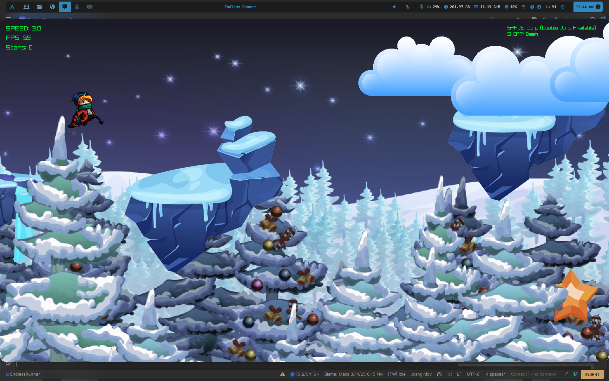

# Endless Runner 🎮

<p align="center">
  
  
  
</p>

---



## Table of Contents
- [Overview](#overview)
- [Features](#features)
- [Project Structure](#project-structure)
- [Build & Installation](#build--installation)
- [Running the Application](#running-the-application)
- [Dependencies](#dependencies)
- [Contributing](#contributing)
- [License](#license)

---

## Overview
**MyExecutable** is a C++ game/application that leverages a modern codebase with clear separation between source code and assets. The project uses CMake as its build system and is organized into well-defined directories for resources, source code, and build output.

---

## Features
- **Modern C++20:** Utilizes modern C++ features for cleaner and more efficient code.
- **Graphics & Multimedia:** Uses a variety of assets such as backgrounds, clouds, platforms, and more.
- **Modular Design:** Source code is split into implementation files (`src/cpp`) and headers (`src/headers`).
- **Cross-Platform Build:** Configured with CMake for easy compilation on multiple platforms.
- **Organized Resources:** All media assets (images, fonts) are stored in the `resources/` directory.

---

## Project Structure

```plaintext
.
├── build                 # CMake build directory (generated)
│   └── ...               # Build artifacts, caches, and compiled object files
├── CMakeLists.txt        # Main CMake configuration file
├── resources             # Game/media assets
│   ├── background        # Background images (BG, FG, MG, Sky, etc.)
│   ├── clouds            # Cloud images
│   ├── fonts             # Font files (e.g., GenShinGothic-Regular.ttf)
│   ├── platforms         # Platform images (p1.png, p2.png, etc.)
│   ├── rocks             # Rock images
│   ├── scarfy.png        # Game character image
│   └── star.png          # Star image
└── src                   # Source code
    ├── cpp               # Implementation files (e.g., Game.cpp, Character.cpp)
    └── headers           # Header files (e.g., Background.hpp, Game.hpp)
...
```

---

## Build & Installation

### Clone the Repository:
```bash
git clone https://github.com/yourusername/your-repo-name.git
cd your-repo-name
```

### Create a Build Directory and Configure with CMake:
```bash
mkdir build && cd build
cmake ..
make
```

### Build the Project:
```bash
cmake --build .
```
This will generate the executable (named MyExecutable or as defined in your CMakeLists.txt) in the `build/` directory.

---

## Running the Application
After a successful build, run the executable:
```bash
./MyExecutable
```
Make sure that the working directory is set such that the application can locate the `resources` folder. You may need to run it from the project root or adjust paths in your CMake configuration.

---

## Dependencies
- **C++20 Compiler:** Ensure your compiler supports C++20 (e.g., GCC 10+, Clang 10+, MSVC 2019+).
- **CMake:** Version 3.20 or higher.
- **Additional Libraries:** Raylib.

---

## License
This project is licensed under the MIT License.
